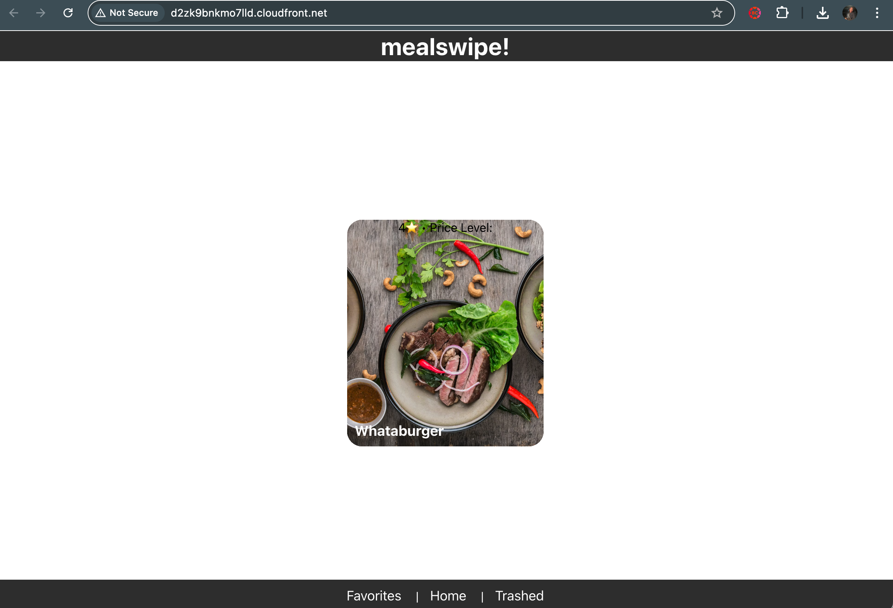

# Individual Weekly Report

**Name**:

David Rodriguez Sanchez

**Team**: 

MealSwipe

**Date**:

3rd March 2025

## Current Status

### What did _you_ work on this past week?

| Task | Status | Time Spent | 
| ---- | ------ | ---------- |
|   Finished CI/CD Pipeline   |   [x]     |      8hrs      |
|   Deployed website   |   [x]     |      3hrs      |
|   Reduced costs of infrastructure   |   [x]     |      2hrs      |

<small>Picture of the deployed website. Ayone has access to this website.</small>

### What problems did you run into? What is your plan for them?

One of the biggest problems I am currently running into is the price of maintaining the entire website. Right now it is projected to be around $40 by the end of March. So now I am working a lot on making sure that makes sense.

### What is the current overall project status from your perspective? 

The project is now a bit behind schedule, we still do not have proper testing (i.e. unit, stress, and integration tests). The CI/CD pipeline simply checks whether there is no syntax errors.

### How is your team functioning from your perspective?

The team is increasingly turning a bit more occupied with other things. So it is starting to become a bit more difficult to finish all of our goals. I am still hopeful that it might work.

### What new ideas did you have or skills did you develop this week?

I was super busy this week, so time management was an essential skill I had to start using. In a more technical aspect; I feel I learnt something new everyday I was working with AWS and infra. I worked a lot on debugging and analyzing the cost of our current infra. So that was a lot of a learning curve.

### Who was your most awesome team member this week and why?

Sanjay! He was in charge of orchestrating the changes from the rest of the team while I was working with the CI/CD pipeline.

## Plans for Next Week

Now with our foundation set, I will start working on adding features and start emptying the sprint 1 backlog.
